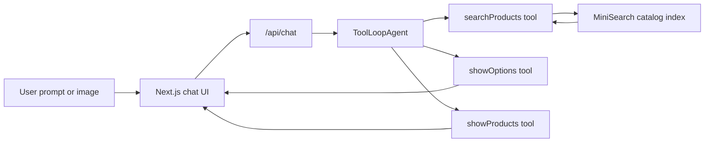

# Fufus

An Amazon Rufus-inspired AI shopping assistant built with Next.js, React, Tailwind CSS, the Vercel AI SDK, OpenAI GPT-5.4, and MiniSearch.

Fufus turns a static product catalog into a conversational shopping experience: users can describe what they want, upload an image, narrow ambiguous requests with tappable options, and receive curated product cards backed by search results instead of hallucinated recommendations.

> This project is an independent prototype and is not affiliated with Amazon.

## Screenshots

<p align="center">
  
  
  
</p>

## Why it is interesting

- **Agentic commerce UX**: a shopping-focused chat agent can clarify intent, search a catalog, and render structured product cards in one flow.
- **Tool-grounded recommendations**: the assistant is instructed to recommend only products returned from the catalog search tool.
- **Recruiter-friendly full stack slice**: the repo includes the UI, chat API route, agent configuration, tool schemas, product search index, and sample product data.
- **Multimodal input path**: users can attach images, and the agent can use visual context to form product searches.
- **Fast local retrieval**: MiniSearch indexes 9,287 products across fashion, electronics, home, and sports categories.
- **Mobile-first polish**: the interface is built around a compact phone-like shopping surface with streamed responses, option chips, product cards, image previews, and loading states.

## Core features

- Conversational product discovery powered by the Vercel AI SDK.
- OpenAI GPT-5.4 agent configured with explicit shopping guardrails.
- Server-side product search over a local JSON catalog.
- Category and price filtering through typed tool inputs.
- Clickable clarification options for ambiguous shopping requests.
- Product-card tool output with title, image, price, rating, description, and store.
- Image upload and clipboard paste support for visual shopping prompts.
- Streaming chat responses through a Next.js API route.
- Toast-based error handling and responsive chat autoscroll.

## Tech stack

| Area | Technology |
| --- | --- |
| App framework | Next.js 16 App Router |
| UI | React 19, TypeScript, Tailwind CSS 4 |
| AI orchestration | Vercel AI SDK `ToolLoopAgent` |
| Model provider | OpenAI via `@ai-sdk/openai` |
| Search | MiniSearch |
| Validation | Zod |
| UX utilities | Sonner, use-stick-to-bottom |
| Tooling | ESLint, Biome |

## How it works



The agent has three UI-aware tools:

- `searchProducts`: searches the product catalog with optional category, price, limit, and offset filters.
- `showOptions`: renders tappable clarification choices when the user request is underspecified.
- `showProducts`: displays up to three selected products from search results as rich cards.

The key design decision is that the model does not invent catalog items. Product cards are rendered only after IDs have been returned by `searchProducts`, which keeps the chat experience grounded in real data.

## Project structure

```text
.
├── app/
│   ├── app/
│   │   ├── api/chat/route.ts      # AI SDK streaming endpoint
│   │   ├── layout.tsx             # App shell and metadata
│   │   └── page.tsx               # Shopping UI and chat surface
│   ├── lib/
│   │   ├── agents/chat-agent.ts   # GPT-5.4 ToolLoopAgent configuration
│   │   ├── search-index.ts        # MiniSearch catalog setup
│   │   └── tools/                 # Search, product-card, and option tools
│   └── package.json
├── data/products.json             # 9,287-product local catalog
└── images/                        # README screenshots
```

## Local development

Prerequisites:

- Node.js 20+
- An OpenAI API key

Install dependencies:

```bash
cd app
npm install
```

Create `app/.env.local`:

```bash
OPENAI_API_KEY=your_openai_api_key
```

Run the app:

```bash
npm run dev
```

Then open `http://localhost:3000`.

## Useful scripts

```bash
npm run dev      # Start the Next.js development server
npm run build    # Build the production app
npm run start    # Start the production server
npm run lint     # Run ESLint
```

## Example prompts

- "Find me a casual blue dress under $50."
- "I need running shoes for daily training."
- "Show me practical gifts for a home office."
- "Help me find something similar to this." Then attach an image.
- "I'm looking for a bag." The assistant should respond with clarification options instead of guessing.

## Engineering notes

- The catalog index is created once on the server from `data/products.json`.
- Product search boosts title matches, supports fuzzy matching, and enables prefix matching.
- Tool input schemas are defined with Zod so agent actions stay structured.
- The chat route uses `createAgentUIStreamResponse`, allowing tool results to stream into the UI.
- The frontend deduplicates repeated tool-loop search indicators so the conversation stays readable.
- Remote product images are restricted through `next.config.ts` to Amazon media URLs used by the dataset.

## Current limitations

- The catalog is static and local; there is no live inventory, checkout, or user account system.
- Product ranking is intentionally lightweight and based on MiniSearch relevance plus agent-side selection.
- This is a portfolio prototype, not a production marketplace integration.

## What I would build next

- Add persistent conversations and saved product shortlists.
- Add evaluation tests for tool-use behavior and no-hallucination constraints.
- Introduce hybrid search with embeddings for softer semantic matching.
- Track product-card interactions to improve ranking.
- Add deployment-ready configuration for Vercel.
